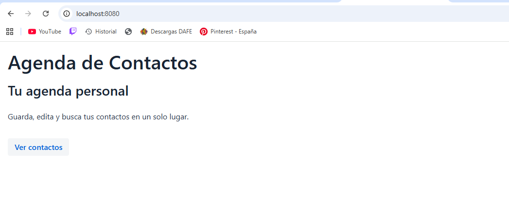

# Semana 7: Vaadin — Primera App Web

Este proyecto marca el inicio de la transición de nuestra Agenda de Contactos de una aplicación de consola a una interfaz gráfica web moderna. Utiliza Spring Boot para el backend y Vaadin para la interfaz de usuario.

## Requisitos
- Java .
- Maven .

## Cómo ejecutar la aplicación

- Abre una terminal dentro de la carpeta del proyecto:
- cd SEMANA-07-AGENDA-WEB
- mvn spring-boot:run

## Imagen del navegador 

   